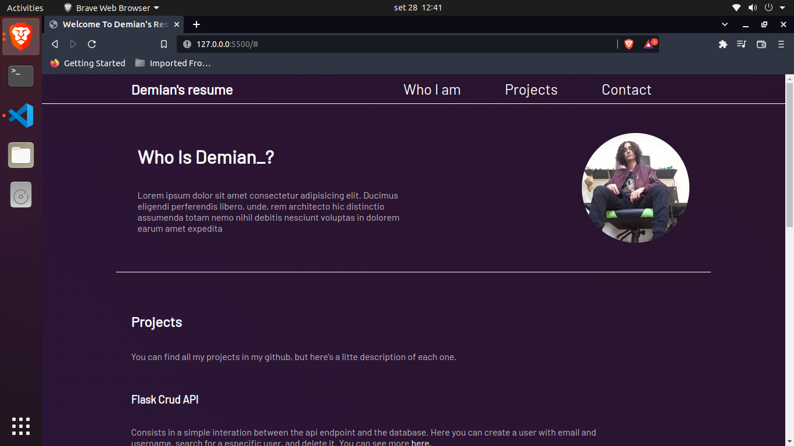

<h1>My Resume Page</h1>

This is a simple page containing info about my contacts, projects, and describing my objectives.
    It's going to use simple HTML, CSS and a little bit of JavaScript.

 

The features I'm working on now:

<ul>
    <li>Three sections, "Who is Demian?", "Projects" and "How to contact me."</li>
    <li>A bottom to switch between En - Pt-Br</li>
    <li>A bottom to switch between gradient animation to dark mode.</li>
</ul>

This is the result until this moment.

